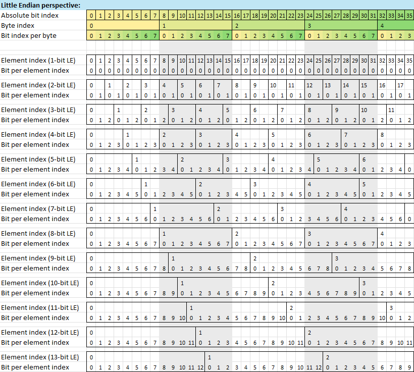
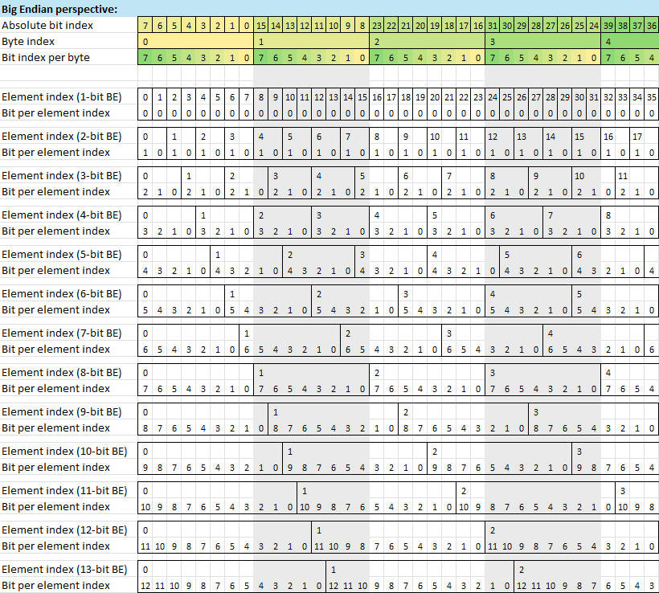
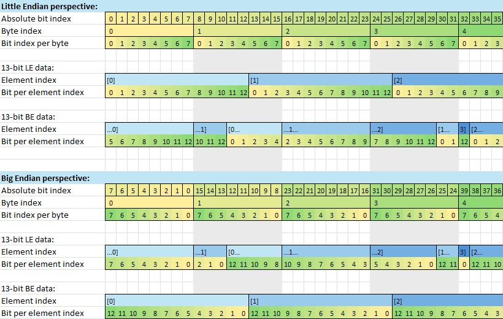
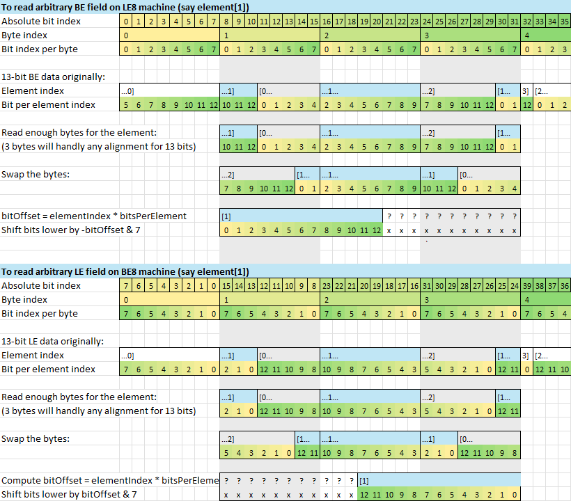
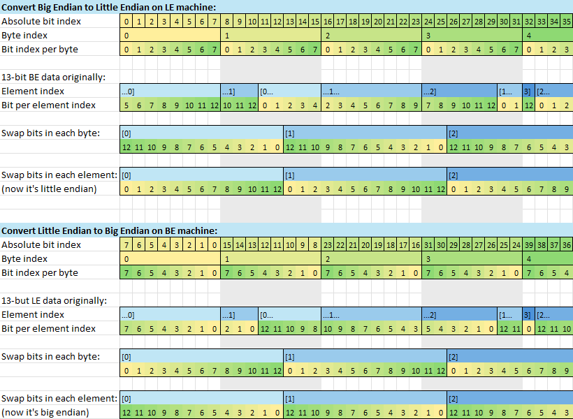

# BitString
Two simple functions (ReadBitString/WriteBitString) to read/write a bitstring from 1-32 bits at any arbitrary bit offset in either little-endian or big-endian layout.
For most needs, you could probably just other options (C/C++ bitfields, std::bitset, std::vector<bool>, _bittestandset...), but this is useful if you need an arbitrary read of unknown data.

## Usage

```c++
    // Read a bitslice 13 bits long starting at bit offset 5.
    const uint8_t data[] = {0x11, 0x22, 0x33, 0x44, 0x55, 0x66};
    uint32_t valueLe = ReadBitString(data, 5, 13, std::endian::little);
    uint32_t valueBe = ReadBitString(data, 5, 13, std::endian::big);
    // valueLe = 0x1910
    // valueBe = 0x0488
    ...

    // Read element[3] of a 12-bit array.
    const uint8_t dataLe[] = {0x21, 0x43, 0x65, 0x87, 0xA9, 0xCB};
    const uint8_t dataBe[] = {0x32, 0x16, 0x54, 0x98, 0x7C, 0xBA};
    uint32_t valueLe = ReadBitString(dataLe, 3*12, 12, std::endian::little);
    uint32_t valueBe = ReadBitString(dataBe, 3*12, 12, std::endian::big);
    // valueLe = 0xCBA
    // valueBe = 0xCBA
    ...

    // Write a float32 at a misaligned bit offset 5.
    uint8_t dataLe[sizeof(float) + 1] = {};
    uint8_t dataBe[sizeof(float) + 1] = {};
    constexpr uint32_t piValueAsUint = std::bit_cast<uint32_t>(3.14159265358979323846f);
    WriteBitString(dataLe, 5, 32, std::endian::little, piValueAsUint);
    WriteBitString(dataBe, 5, 32, std::endian::big, piValueAsUint);
    // LE bytes: 60,FB,21,09,08
    // BE bytes: 02,02,48,7E,D8
```

## Requires
- C++20 (for `std::endian`).
- Tested with Visual Studio 2022, but it's a simple enough file (just copy the BitString header/cpp file) that it will probably work fine on clang/gcc too.

## Building
- Open BitString.sln in Visual Studio Professional/Community 2022.

## Illustrations

### Fields of various sizes in little endian order.

Sequential fields are filled in increasing bitstream/byte stream order, with each field immediately packed after the previous. Byte index, bitstream index, and bit index within each byte are all coherently consistent.



### Fields of various sizes in big endian order:

Sequential fields are filled in retrograde order, where later fields are allocated in increasing byte order overall, but field bit fragments fill within each byte in decreasing order. The bits-per-byte columns are visually reversed accordingly to RTL to help. Notice though that both LE and BE (once you look at it each from its respective view) are *visually* identical for the field boundaries.



### Viewing fields in the same and opposite endianness views:

Note that viewing LE data on an LE machine and BE data on an BE machine both look clear, but BE data on an LE machine and LE data on an BE machine look very convoluted and chopped up, but interestingly, the field division points are identical in both cases.



### Arbitrary slice reads of opposite endianness:

To read data of the opposite endianness from your machine's architecture, read aligned bytes, swap those bytes, and then shift and mask.



### Endianness conversions:

One way to convert endianness of a large array of bitstring elements (like 13-bit elements below) would be to use sliced reads and slice writes, using the approach above. Another way to think about it conceptually (albeit inefficiently) would be to reverse the bits within each byte and reverse the bits in each element, where each reversal partially cancels out the other reversal, while moving all the fragments around to the right locations.


